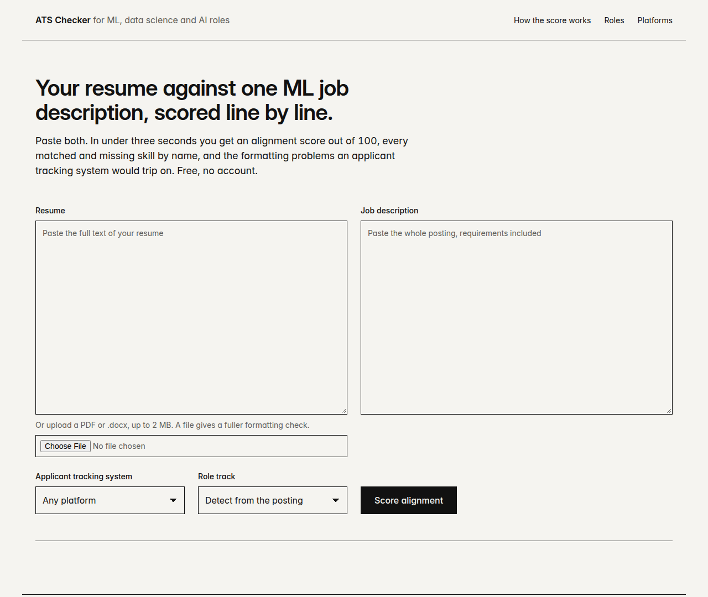
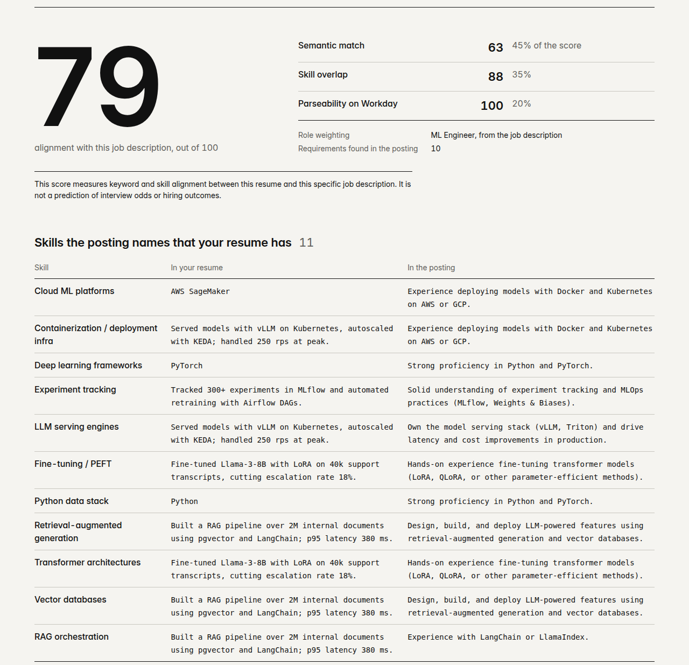

# ATS Checker

An applicant-tracking-system resume checker built only for machine learning, data science
and AI engineering roles. Paste a resume and one job description and, in under three
seconds, get an alignment score out of 100, every matched and missing skill by name, and
the formatting problems a parser would trip on. That check is free, runs entirely on the
server, and never calls a metered model API. A paid deep report goes further: a
retrieval-grounded explanation of every match and gap, plus rewrites of weak bullets that
cite the curated examples they were drawn from.

The score measures keyword and skill alignment between one resume and one posting. It is
not a prediction of interview odds or hiring outcomes, and the product never says otherwise.





Screenshots were taken from the app running locally against the test fixtures in
`tests/fixtures` (a synthetic resume and posting); there is no public deployment yet.

## Status

The free layer works standalone from a fresh clone. The paid layer is built and tested with
Stripe and Claude faked, but has not run against the real services: it needs a Stripe
product and secrets, a Postgres URL, an Anthropic API key on the worker process, and SMTP
for report links. Those are owner-side configuration steps and are not yet done. The
checklist is in `docs/build_plan.md` §7.

## How it works

The system has two layers with a hard cost boundary between them.

**Layer 1, free and deterministic.** The resume (pasted text, PDF or .docx) is parsed into
sections and lines, and checked against eight parseability rules, including a
per-platform severity table for Workday, Greenhouse, Lever and Ashby. The job description is
split into requirements and tagged required or preferred. Three components are computed and
blended:

| Component | Weight | What it measures |
| --- | --- | --- |
| Semantic match | 45% | Each requirement against its best resume line, with a self-hosted sentence embedding model (bge-small, ONNX) |
| Skill overlap | 35% | Coverage of a curated ML/DS/AI skill taxonomy, weighted by the detected role track (ML engineer, applied scientist, data scientist, ML research, data engineer) |
| Parseability | 20% | Formatting checks weighted by severity on the selected platform |

Every number on the page is traceable to a line in the resume and a line in the posting.
No LLM or embedding API is reachable from this path, and an import contract
(`uv run lint-imports`) fails the build if that ever changes.

**Layer 2, paid and grounded.** After payment, a separate worker process, the only one that
holds an API key, runs a retrieval-augmented pipeline: a curated corpus of skill
equivalences, strong bullets, weak-to-strong rewrite pairs and cited platform behaviour is
searched with hybrid dense plus BM25 retrieval, and a Claude model (default
`claude-sonnet-5`, set via `ATSC_DEEP_LLM_MODEL`) writes explanations and rewrites that
must cite numbered context passages. The code resolves those citations back to verbatim
corpus text, so an output without grounding cannot be constructed. Rewrites that push
keyword density at the cost of readability are flagged, and a diff of all suggested
changes is downloadable.

The interface is server-rendered HTML with htmx and no JavaScript build step.

## Quickstart

Requires Python 3.12 and [uv](https://docs.astral.sh/uv/).

```
uv sync --group dev
uv run uvicorn atsc.web.app:app --reload
```

Open http://127.0.0.1:8000. The first start downloads the two embedding models into a local
cache; after that nothing leaves the machine on the free check.

Checks that run in CI:

```
uv run pytest
uv run ruff check . && uv run ruff format --check .
uv run mypy
uv run lint-imports        # must report both contracts "KEPT"
```

Further commands (worker, smoke test, retrieval benchmark, retention job) are listed in
`CLAUDE.md`, and all runtime settings in `.env.example`.

## Documentation

The product and technical specifications live in `docs/`, starting with
`product_requirements.md`. `docs/build_plan.md` records how the specs were interpreted,
every engineering decision and why, and a per-phase status log of what was built, what was
decided along the way, and what is left.

## License

MIT, see `LICENSE`. Bundled fonts (Inter, IBM Plex Mono) are under the SIL Open Font
License and htmx under the BSD Zero Clause License; their notices are in
`src/atsc/web/static`.
